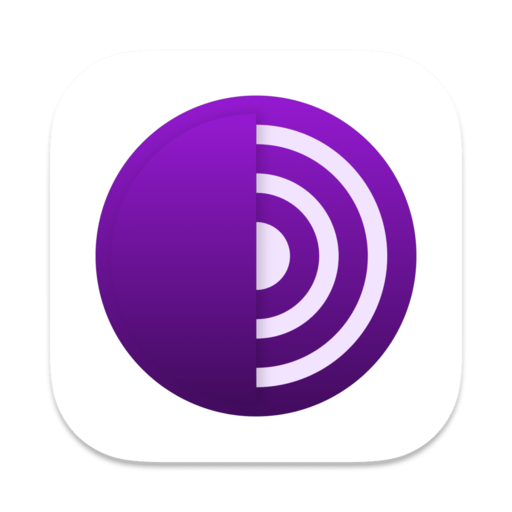

# Dark Web Links Directory & Safety Guide

A comprehensive, curated directory of educational and research-oriented `.onion` links, combined with a rigorous safety framework for secure navigation of the dark web.

---

## ⚠️ Disclaimer
**For Educational and Research Purposes Only.**
Accessing the dark web involves significant risks, including exposure to illegal content and potential security threats. This repository is designed to provide a structured overview for researchers and students. The maintainer is not responsible for any misuse of this information or any legal consequences resulting from your actions. **Always comply with your local laws.**

---

## 📑 Table of Contents
- [Introduction](#-introduction)
- [Key Features](#-key-features)
- [Safety Framework](#-safety-framework)
- [Directory Categories](#-directory-categories)
  - [Search Engines](#search-engines)
  - [Privacy Tools](#privacy-tools)
  - [Knowledge Bases](#knowledge-bases)
- [Advanced Security Tips](#-advanced-security-tips)
- [License](#-license)

---

## 🚀 Introduction
The dark web remains one of the most misunderstood parts of the internet. While often associated with illicit markets, it serves as a vital tool for whistleblowers, journalists, and individuals living under censorship. This project aims to demystify the dark web by providing verified links to legitimate services and a robust safety protocol.

## ✨ Key Features
- **Verified Links:** All links are manually checked for relevance to educational research.
- **Safety-First Approach:** Integrated guidelines to ensure user anonymity and system security.
- **Categorized Directory:** Easy navigation through different types of hidden services.
- **Privacy Centric:** Focus on tools and services that prioritize user data protection.

---

## 🛡️ Safety Framework
Before you even consider clicking a link, you must establish a secure environment.

1. **The Tor Network:** Never use a standard browser. Use the official [Tor Browser](https://www.torproject.org/).
2. **Identity Isolation:** Never use your real name, email, or any handle that can be linked back to your physical identity.
3. **Network Security:** Use a trusted VPN *before* connecting to Tor to hide the fact that you are using Tor from your ISP.
4. **Hardware Privacy:** Cover your webcam and disable your microphone when browsing.

---

## 📂 Directory Categories

### Search Engines
Search engines on the dark web are the primary way to discover hidden services.

| Service | Description | Onion Link (Example) |
| :--- | :--- | :--- |
| **Ahmia** | The most popular and cleanest search engine for Tor. | `http://msydqstlz2kzerz4.onion/` |
| **DuckDuckGo** | The privacy-focused search engine's onion portal. | `https://duckduckgogg42xjoc72x3sjasowoarfbgcmvfkyivxtnfmxw4qjnr2lh.onion/` |

### Privacy Tools
Tools designed to enhance your digital footprint security.

| Tool | Purpose |
| :--- | :--- |
| **ProPublica** | Investigative journalism with a secure onion drop. |
| **SecureDrop** | An open-source whistleblower submission system. |

### Knowledge Bases
Libraries and wikis for deep-dive research.

- **Imperial Library of Trantor:** A massive repository of digitized books.
- **The Hidden Wiki (Censored Version):** A directory of links (Use with caution).

---

## 🔐 Advanced Security Tips
- **No Script Policy:** Always keep JavaScript disabled in Tor's "Safest" mode.
- **Avoid Full Screen:** Do not maximize your Tor Browser window; it can be used for browser fingerprinting.
- **Tails OS:** For maximum security, run your session from a live USB using [Tails](https://tails.boum.org/).
- **Metadata Scrubbing:** If you must upload or share files, use tools like MAT2 to remove metadata first.

---

## 📜 License
This project is licensed under the MIT License. See the [LICENSE](LICENSE) file for details.
